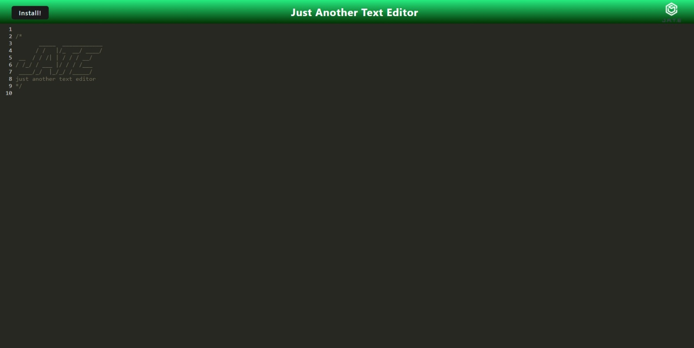

# PWA
  ## Licence:
  

  ## Description
This project features some of the most impressive expressions of the concepts I have learned so far. The task is to build a text editor that runs in the browser. The app will is a single-page application that meets the PWA criteria. Additionally, it feature a number of data persistence techniques that serve as redundancy in case one of the options is not supported by the browser. The application will also function offline.

To build this text editor, I started with an existing application and implemented methods for getting and storing data to an IndexedDB database. I used a package called idb, which is a lightweight wrapper around the IndexedDB API. It features a number of methods that are useful for storing and retrieving data.

This full-stack application has been deployed to Heroku.

  ## Table of Contents
  - [Installation](#installation)
  - [Usage](#usage)
  - [Credits](#credits)

  ## Installation
  This is a screenshot of the application:

  - This is the link to the deployed app: https://sleepy-dawn-64785-b6af0c0c9895.herokuapp.com/
  
  

  ## Usage
  - You can run it locally by cloning the repo and running npm run start:dev in your terminal.
  - You can also just go to the the deployed app and start using it there.

  ## Credits
  N/A
